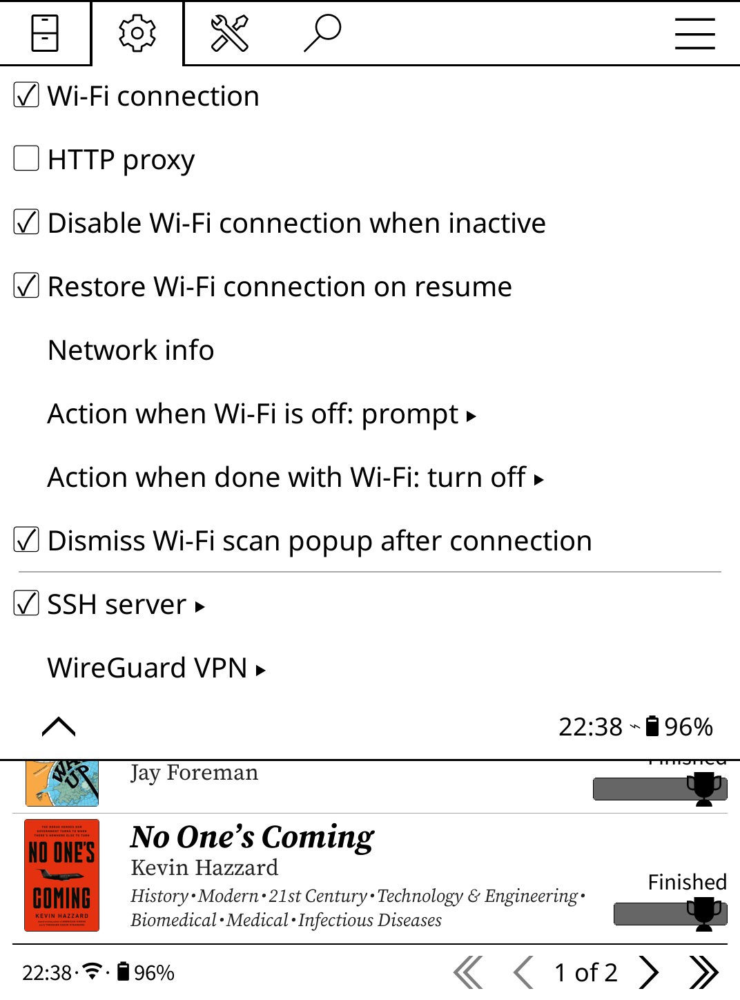
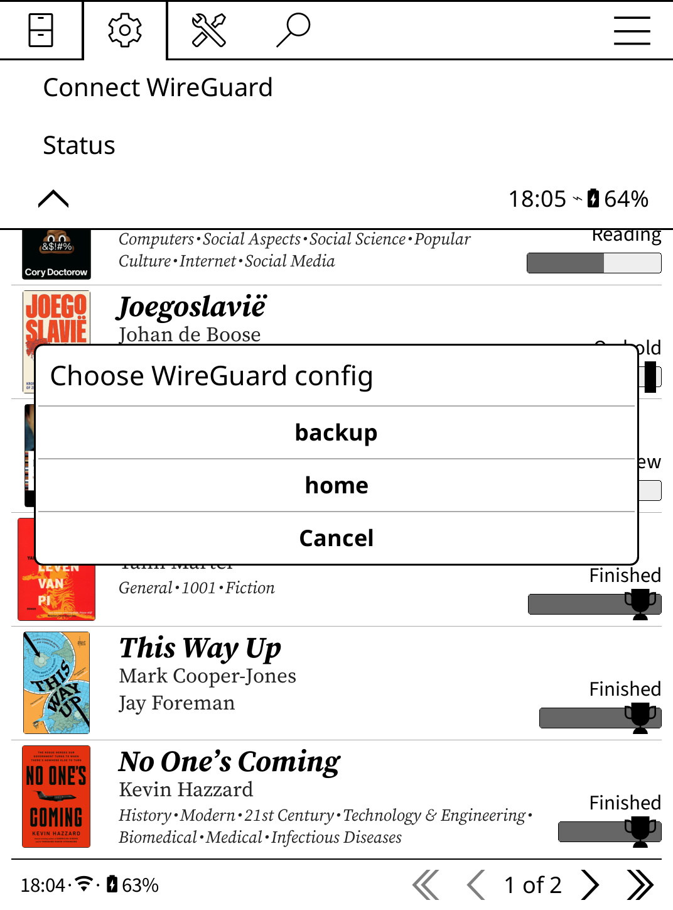
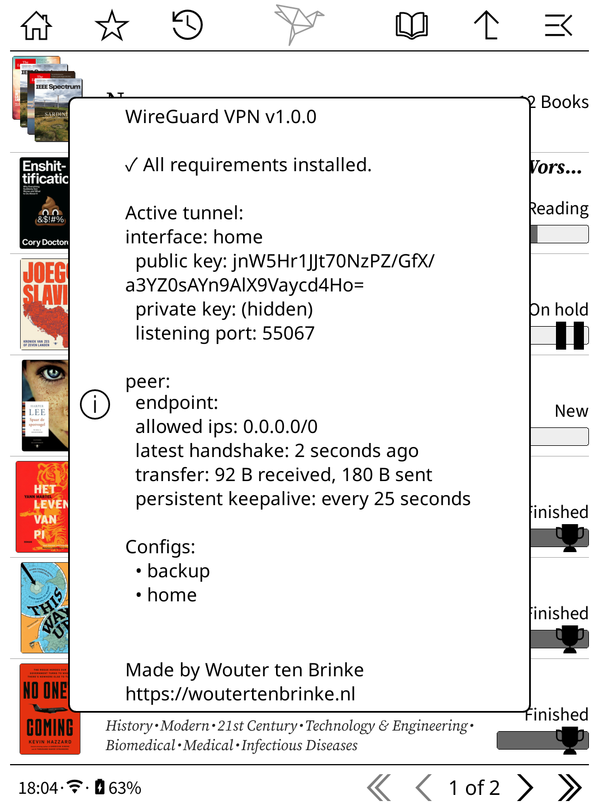

# WireGuard for KOReader

A [KOReader](https://github.com/koreader/koreader) plugin to bring a WireGuard VPN up and down from the menu.

I am not affiliated with KOReader or with WireGuard. Just a wrapper I made for my own use.

Tested only on a **Kobo Clara Colour**. Other Kobo models will probably work, other devices YMMV.

> **Looking for something easier?** If you just want a VPN on your e-reader and don't specifically need WireGuard, the [Tailscale plugin for KOReader](https://github.com/victoria-riley-barnett/koreader-tailscale) ships with an install script and works out of the box, no cross-compiling required.

## Screenshots

| Menu | Config picker | Status |
|---|---|---|
|  |  |  |

## 1. Build the binaries

WireGuard binaries don't ship on Kobo devices, and at the time of writing there are no pre-built binaries available from reputable sources, so you have to cross-compile them yourself. Kobo kernels are also too old to include the WireGuard kernel module, which is why `wireguard-go` (the userspace implementation) is required alongside `wg`.

Sources:

- `wg` from [wireguard-tools](https://github.com/WireGuard/wireguard-tools)
- `wireguard-go` from [wireguard-go](https://github.com/WireGuard/wireguard-go)

Find your arch first (see [SSH](#ssh) below):

```sh
ssh -p 2222 root@<e-reader> 'uname -m'
```

On a Clara Colour that's `armv7l`, so the targets below are armv7. Adjust if yours differs.

I built mine with Docker. The `wg` build runs a Debian armv7 container under emulation, which is slower but avoids needing a cross-compiler. `wg` is small so it still only took about 30 seconds:

```sh
# wg
docker run --rm --platform linux/arm/v7 -v "$PWD:/out" -w /src debian:bookworm-slim sh -c '
  apt-get update && apt-get install -y --no-install-recommends \
    git make gcc libc6-dev ca-certificates
  git clone https://github.com/WireGuard/wireguard-tools
  cd wireguard-tools/src
  make LDFLAGS=-static
  cp wg /out/
'

# wireguard-go
docker run --rm -v "$PWD:/out" -w /src golang:latest sh -c '
  git clone https://github.com/WireGuard/wireguard-go
  cd wireguard-go
  GOOS=linux GOARCH=arm GOARM=7 CGO_ENABLED=0 go build -o /out/wireguard-go
'
```

## 2. Put the binaries on the device

```sh
scp -P 2222 wg wireguard-go root@<e-reader>:/usr/bin/
ssh -p 2222 root@<e-reader> 'chmod +x /usr/bin/wg /usr/bin/wireguard-go'
```

Confirm `/dev/net/tun` exists:

```sh
ssh -p 2222 root@<e-reader> 'ls -l /dev/net/tun'
# if missing:
ssh -p 2222 root@<e-reader> 'mkdir -p /dev/net && mknod /dev/net/tun c 10 200'
```

## 3. Install the plugin

Download the latest `wireguard.koplugin-vX.Y.Z.zip` from the [releases page](../../releases/latest) and unzip it into your KOReader plugins folder, e.g.:

```
/mnt/onboard/.adds/koreader/plugins/wireguard.koplugin/
```

(Or clone this repo into your plugins folder as `wireguard.koplugin/`

Put your `.conf` files in the `configs/` folder:

```
.../wireguard.koplugin/configs/
```

The filename (without `.conf`) becomes the interface name.

Restart KOReader. Plugin appears under **Network > WireGuard VPN**.

## Use

The plugin lives under Network > WireGuard VPN. Tap the first item to bring the tunnel up or down, picking a config if there's more than one. Tap Status to see which binaries are present, the current `wg show` output and the configs the plugin found.

### Gestures and profiles

Four actions are registered with KOReader's Dispatcher and show up under Gesture Manager > General (or in any profile):

- WireGuard connect
- WireGuard disconnect
- WireGuard toggle
- WireGuard status

## SSH

If you haven't enabled SSH on your e-reader yet, follow this guide: <https://dmpop.github.io/koreader-compendium/16-ssh/>.

## License

MIT, see [LICENSE](LICENSE).

Made by [Wouter ten Brinke](https://woutertenbrinke.nl).
